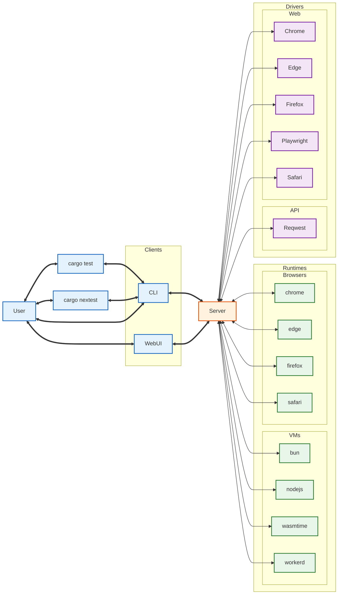

# Workers Test Runner Architecture

The `auroka_test_runner` implements a **Client-Server Architecture** (similar to Docker or Bazel). This design is required to bridge the gap between the massive parallelism of `cargo nextest` and the heavy, singleton nature of browsers and runtimes.

## Why a Daemon?

Without a central coordinator, running `cargo nextest` would spawn a separate `workerd` or Browser instance for every single test file, leading to:
1.  **Resource Exhaustion:** 16 Chrome instances opening at once.
2.  **Cold Starts:** Paying the 500ms+ startup penalty for every test.

The **Orchestrator Daemon** solves this by acting as a **Resource Multiplexer**. It keeps a pool of "warm" runners ready and routes test requests to them, ensuring that `cargo nextest` remains fast while the heavy lifting is managed efficiently.

## System Architecture

The system is composed of three layers. The **Control Plane** (Server) sits in the middle, mediating between **Clients** (Users) and **Agents** (Workers).

